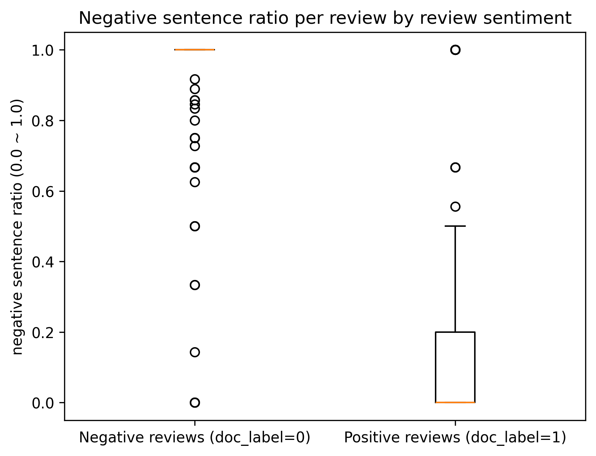
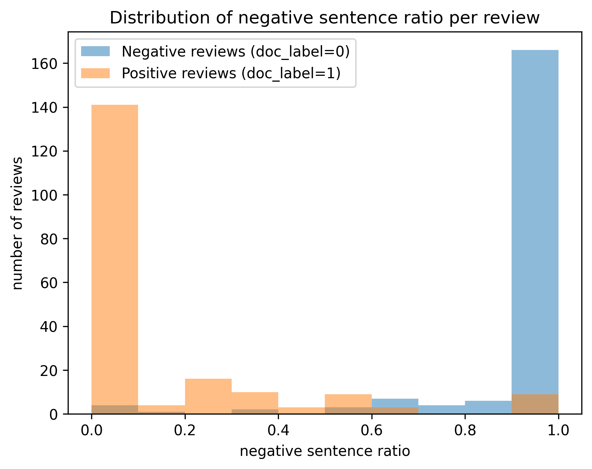

# 네이버 식당 리뷰 긍정/부정 분류기

## KR3(korean restaurant review with ratings) 공개 데이터셋
- https://github.com/yejoon-lee/kr3?tab=readme-ov-file#where-to-download-the-dataset
- https://drive.google.com/drive/folders/1rfrcrT08bIA1nBUeJxfxkxqjI7Z9L4B8?usp=drive_link
- 파일명 : kr3_filtered_utf8.csv
- 공개 데이터셋
- 총 64만 행, 약 200MB
- 리뷰 단위 라벨링
- 긍정은 1, 부정은 0, 애매하거나 정보성 문장은 2

### 추가 데이터셋 생성의 필요성

제가 이 데이터셋을 살펴본 결과 라벨링 기준이 저와는 조금 차이가 있다고 느꼈습니다.
저는 조금이라도 부정적인 언급이 있다면 부정 리뷰로 라벨링하고 싶은데, 이 데이터셋은 전반적인 리뷰의 내용에 더 집중했습니다.

ex) 고기가 육즙이 가득하고 정말 맛있었어요! 가격이 조금 사악하긴 합니다. -> 긍정(1) 라벨링

이런 리뷰는 전반적으로 보았을 때는 긍정에 속하지만, 긍정 리뷰 내에 부정적인 내용의 문장도 포함되어 있습니다.(가격이 사악하다.)
저는 부정 리뷰의 내용도 중요하지만, 이렇게 긍정 리뷰 내의 부정 문장도 중요한 가치를 지닌다고 생각했습니다.

그래서 리뷰 단위가 아닌 문장마다의 더 세밀한 감정 구간을 학습하고, 저의 라벨링 기준도 더 반영하기 위해 별도의 KR3_sentence_label 데이터셋을 만들어 직접 라벨링을 진행하였습니다.
- KR3의 리뷰 중 긍정/부정 라벨의 비율을 동일하게 하여 각각 200개씩 샘플링
- ㄴ data leakage 방지를 위해 원본 데이터셋에서는 해당 리뷰 삭제
- kss(Korean Sentence Splitter) 라이브러리를 이용해 문장으로 쪼갬
- 이후 나만의 기준으로 문장 단위 긍정/부정 직접 라벨링

이 과정은 kr3_review_sentence_split.ipynb 파일에서 확인할 수 있으며, Gemini의 도움을 받았습니다.

  
## KR3_sentence_label 데이터셋
- https://drive.google.com/drive/folders/1rfrcrT08bIA1nBUeJxfxkxqjI7Z9L4B8?usp=drive_link
- 파일명 : kr3_sentence_label(add).csv
- 직접 라벨링한 데이터셋
- 총 1470 행, 약 130KB
- 문장 단위 라벨링
- 긍정은 1, 부정은 0, 애매하거나 정보성 문장은 2

## Data Analysis

### KR3
- 긍정 리뷰(1) 비율이 60%, 부정 리뷰(0) 비율이 11%로 약 6배 정도의 라벨 비율 차이가 있습니다.
- 이러한 데이터 불균형을 처리할 수 있는 장치가 필요할 것 같습니다.(WeightedRandomSampler, Lossweight 등)
- 라벨링된 각 리뷰의 길이는 평균 127자 정도입니다. 하나의 감정만을 담고 있다기엔 꽤 긴 길이입니다.

### KR3_sentence_label
- 리뷰를 샘플링하는 과정에서 라벨 비율을 맞추었더니, 기존 데이터셋에 비해 불균형이 덜해졌습니다.
- 긍정 리뷰(1) 비율이 37%, 부정 리뷰(0) 비율이 44%입니다. 기존 데이터셋과 달리 부정 리뷰의 비율이 더 높습니다.
- 직접 라벨링하는 과정에서 느낀 건데, 부정 리뷰는 대부분 부정 문장이지만 긍정 리뷰는 부정 문장이 종종 섞여있습니다. 이런 케이스가 실제로 발견된다는 건 리뷰 단위 라벨만으로는 문장 단위 감성을 충분히 표현하기 어렵고, 제가 직접 라벨링한 KR3_sentence_label 데이터셋이 제 기준에 맞는 모델을 학습시키는 데에 유용하다는 뜻이기도 합니다.
- 라벨링된 각 문장의 길이는 평균 31자 정도입니다.
  
### 부정 문장 비율 박스플롯(boxplot)

 

#### 박스 플롯의 해석
- 주황색 선 : 중앙값(Median)
- 박스 : 상위 25% ~ 하위 25%, 즉 중간 50%의 데이터가 모여 있는 구간
- 박스 위 세로선(whisker) : 세로선 끝의 가로선까지는 이상치로 보지 않습니다.
- 동그라미 : 이상치(Outliers), 일반적인 분포를 벗어난 데이터들

#### 부정 리뷰
- 박스가 부정 비율 1.0 부분에 납작하게 붙은 형태로 보아, 부정 리뷰는 대부분 부정 문장으로 이루어져있음을 알 수 있습니다.
- 부정 비율이 1.0보다 낮은 부정 리뷰는 전부 이상치로 간주됩니다. 즉, 흔하지 않습니다.

#### 긍정 리뷰
- 중앙값이 부정 비율 0인 것으로 보아 대부분의 긍정 리뷰는 부정 문장이 아예 들어있지 않습니다.
- 긍정 리뷰 데이터의 75%까지는 부정 문장 비율이 0.2 이하입니다.
- 그렇지만 박스 위 세로선(whisker)을 보면 부정 비율 0.5까지는 이상치로 보지 않는 것을 알 수 있습니다.
- 이는 긍정 리뷰 안에 부정 문장이 섞인 경우가 꽤 있으며, 리뷰 단위 라벨만으로는 문장 단위의 감성을 완전히 대표하지 못함을 보여줍니다.

### 부정 문장 비율 히스토그램(histogram)

- 부정 리뷰 대부분은 부정 문장으로 이루어져 있으나, 간혹 긍정 문장이 포함되어 있기도 합니다.
- 긍정 리뷰도 마찬가지로 간혹 부정 문장을 포함하며, 그 빈도는 부정 리뷰보다 높은 것 같습니다.
